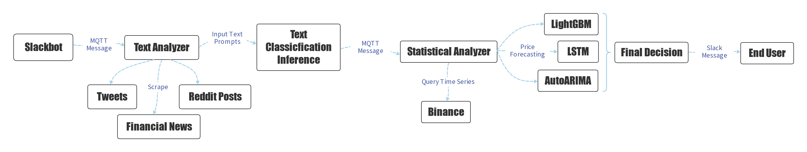

# CATBOT - Crypto Auto Trading Bot
CATBOT is a final capstone project for FINA4162 Big Data Applications and Financial Analytics, Advanced Diploma in FinTech, HKU School of Professional and Continuing Education. CATBOT is a cloud application dedicated to auto cryptocurrency trading powered by primitive text scraping, text classification, and time series analysis. We aim for a lightweight cloud application to get the best cost-performance efficiency.

---

## Pipeline Diagram



---

### Prerequisites

- Docker: [https://www.docker.com/](https://www.docker.com/)

- Docker-compose: [https://docs.docker.com/compose/install/](https://docs.docker.com/compose/install/)

---

### Minimum System Requirements

```
CPU: i5-6500 or Equivalent
Memory: 2 GB RAM
Storage: 18 GB available space
```

---

## Development

```bash
# Build Docker images
make build

# Start containers
make start
```

## Deployment

```bash
# Build Docker images
make build

# Start containers
mode=prod make start
```

---

## Clean up

```bash
# Remove all containers
make clean
```

---

# More Details on Pipeline Components

## Slack Bot

The Slack bot records all analysis results on Slack channels and sends notifications on trades processed. The following commands are supported:

```
help: Show all you can do with CATBOT
    - Format: help
target: Target the cryptocurrency for trading
    - Format: target [target_1] [target_2] ...
    - Example: target BTCUSDT ETHUSDT
untarget: Untarget the cryptocurrency for trading
    - Format: untarget [target_1] [target_2] ...
    - Example: untarget BTCUSDT ETHUSDT
list_targets: List the currently targets set
    - Format: list_targets
set_log: Set the channel for logging
    - Format: set_log
unset_log: Unset the channel for logging
    - Format: unset_log
analyze: Start a text plus statistical analysis on targeted cryptocurrencies
    - Format: analyze
t_analyze: Start text analysis on a set of keywords
    - Format: t_analyze [keyword_1] [keyword_2]
    - Example: t_analyze crypto
s_show_klines: Show the klines of targeted coin
    - Format: s_show_klines [target] [number of hours to collect data] [sampling frequency]
    - Example: s_show_klines BTCUSDT 24 5m
s_show_last_predict: Show the prediction of targeted coin
    - Format: s_show_last_predict [target]
    - Example: s_show_klines BTCUSDT

# NOTE: require_privilege in the help command message means whether every user can call the command
# Or the command will only be callable for the admin Slack user
# It is configurable at configs/slackbot/commands.yml
```

Due to the time constraint on development, currently, only the following targets are supported:
- BTCUSDT
- ETHUSDT
- BNBUSDT
- MATICUSDT
- SOLUSDT
- LTCUSDT
- SHIBUSDT
- XRPUSDT
- FILUSDT
- APTUSDT
- ADAUSDT

---

## Text Analyzer

The text analyzer contains the following parts:

    1. Financial News Scraper, to scrape text contents from financial news websites
    2. Reddit Post Scraper, to scrape Reddit posts
    3. Twitter Post Scraper, to scrape Tweets
    4. Text Classification, to give a score to each text content scraped

---

## Statistical Analyzer

The statistical analyzer contains the following parts:

    1. Binance API, to query time series data from Binance
    2. Compose of time series models, to analyze queried time series data and forecast the future trend
        a. AutoARIMA
        b. LSTM (Need to be enabled in config file to spare computational power)
        c. LightGBM

---

## MQTT Broker

The MQTT Broker is used for container-to-container communication.

---

## Presentation Material

Work in progress

---

## Future Development

In the future, we may update CATBOT with the following changes:

    - Trading related commands
    - Self trained text classifcation model
    - Better financial news scrapers with Selenium
    - Self trained time series forecasting model
    - More time series forecasting algorithms
    - Multi-platform supports, for example, Discord

---

## Authors
[@wyhwong](https://github.com/wyhwong), [@KenHo11](https://github.com/KenHo11), [@wayneau1220](https://github.com/wayneau1220)
